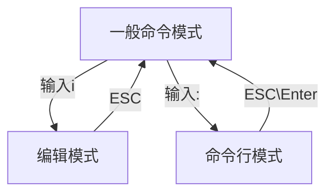

[toc]

# 一.常用命令

## shell操作

```
ctrl c: 取消命令，并且换行
ctrl u: 清空本行命令
tab键：可以补全命令和文件名，如果补全不了快速按两下tab键，可以显示备选选项
```


## 目录说明

```
“/”代表根目录
“..”代表上一级目录
“.” 代表当前目录
“~”代表HOME目录
“-”代表前一目录
```


## 常用命令

| 命令                  | 作用                                                         | 参数                                                         |
| --------------------- | ------------------------------------------------------------ | ------------------------------------------------------------ |
| `ls`                  | 列出当前目录下所有文件，蓝色的是文件夹，白色的是普通文件，绿色的是可执行文件 | `-a` 显示隐藏文件; `-l` 显示详细信息; `-h` 自动调整存储单位  |
| `pwd`                 | 显示当前路径                                                 |                                                              |
| `cd xxx`              | 进入XXX目录下                                                |                                                              |
| `cp xxx yyy`          | 将XXX文件复制成YYY，XXX和YYY可以是一个路径                   | `-r` 复制目录;                                               |
| `mkdir xxx`           | 创建目录XXX                                                  | `-p` 连续创建文件 ;                                          |
| `touch xxx`           | 创建一个文件，文件名前加.则创建隐藏文件                      |                                                              |
| `rmdir xxx`           | 删除文件夹XXX                                                |                                                              |
| `rm xxx`              | 删除普通文件                                                 | `-r` 递归删除;                                               |
| `mv xxx yyy`          | 将XXX文件移动到YYY，XXX和YYY可以是一个路径，加重命名         |                                                              |
| `cat xxx`             | 展示文件XXX中的内容                                          |                                                              |
| `chmod 权限 xxx`      | 修改文件xxx的权限，权限用BCD码表示， `chmod +r xxx` 添加权限 |                                                              |
| `man [instruction]`   | 查看命令文档                                                 |                                                              |
| `date`                | 显示当前时间                                                 |                                                              |
| `df xxx`              | 查看xxx占用的空间                                            |                                                              |
| `file xxx`            | 查看xxx文件类型                                              |                                                              |
| `ps`                  | 查看进程                                                     | `-au` 详细信息                                               |
| `mail -s 主题 收件人` | 向用户发送邮件，ctrl+d编写完毕                               |                                                              |
| `write 收件人`        | 发送实时消息                                                 |                                                              |
| `grep [string] xxx`   | 查找文件xxx里符合条件的字符串                                | `-r` 递归查找；`-i` 不区分大小写；`-v` 选择查找到的以外的其他内容 |
| `gcc [file.cpp]`      | 编译c++文件                                                  | `-o test.out` 之后使用 `./test.out` 运行                     |
| `sh [file.sh]`        | 运行shell代码                                                |                                                              |
|                       |                                                              |                                                              |
| `wc xxx`              | 统计xxx文件里的行数，单词数，字符数                          | `-c` 只显示字节数；`-l` 只显示行数；`-w` 只显示字符数        |
| `sort xxx`            | 根据xxx文件第一列ASCII码进行对行的升序排序                   | `-k col` 对某一列排序；`-n` 按照数值大小排序；`-u` 排序后去重；`-r` 降序排序；`-t 分隔符` 以分隔符分组 |
| `uniq xxx`            | 对文件内容进行去重，一定要先排好序！                         | `-c` 在行首显示该行重复出现的次数；                          |


---


# 二.tmux

## 作用

1.分屏

2.任务后台执行

结构：

$tmux \begin{cases} session_1 \begin{cases} window_1 \begin{cases} pane_1 - shell_1 \\ pane_2 - sheel_2 \\ \dots \end{cases} \\ window_2 \\ \dots \\ window_n \end{cases} \\ session_2 \\ \dots \\ session_n \end{cases}$ 


## 操作

```
tmux:新建一个session，其中包含一个window，window中包含一个pane，pane里打开了一个shell对话框。

按下Ctrl + b后手指松开，然后按%：将当前pane左右平分成两个pane。
按下Ctrl + b后手指松开，然后按"：将当前pane上下平分成两个pane。
Ctrl + d：关闭当前pane；如果当前window的所有pane均已关闭，则自动关闭window；如果当前session的所有window均已关闭，则自动关闭session。

按下ctrl + a后手指松开，然后按方向键：选择相邻的pane。
按住ctrl + a的同时按方向键，可以调整pane之间分割线的位置。
按下ctrl + a后手指松开，然后按z：将当前pane全屏/取消全屏。
按下ctrl + a后手指松开，然后按d：挂起当前session。
tmux a：打开之前挂起的session。

按下ctrl + a后手指松开，然后按s：选择其它session。
        方向键 —— 上：选择上一项 session/window/pane
        方向键 —— 下：选择下一项 session/window/pane
        方向键 —— 右：展开当前项 session/window
        方向键 —— 左：闭合当前项 session/window
        
按下Ctrl + a后手指松开，然后按c：在当前session中创建一个新的window。
按下Ctrl + a后手指松开，然后按w：选择其他window，操作方法与上面完全相同。

在tmux中选中文本时，需要按住shift键。
tmux中复制/粘贴文本的通用方式：
	(1) 按下Ctrl + a后松开手指，然后按[
	(2) 用鼠标选中文本，被选中的文本会被自动复制到tmux的剪贴板
	(3) 按下Ctrl + a后松开手指，然后按]，会将剪贴板中的内容粘贴到光标处

```


---


# 三.vim

```
vim 文件名: 打开文件,若没有这个文件，则会自动创建
vi 文件名: 同上
```

## 三种模式：

（1）一般命令模式

（2）编辑模式

（3）命令行模式

模式转换：




## 一般命令模式

 ```
n<space>: n表示数字，光标向右移动n个字符
n<方向键>: 光标向相应方向移动n个字符/行
0 或 [home]: 光标移动到行头
$ 或 [end]:  光标移动到行尾
G ： 光标移动到最后一行
gg：光标移动到文档第一行，相当于1G
H：光标移动到屏幕的第一行
L：光标移动到屏幕最后一行
:n 或 nG：n为数字，光标移动到第n行
n<Enter>：n为数字，光标向下移动n行

/word：向光标之下寻找第一个值为word的字符串。
?word：向光标之上寻找第一个值为word的字符串。
n：重复前一个查找操作
N：反向重复前一个查找操作
:n1,n2s/word1/word2/g：n1与n2为数字，在第n1行与n2行之间寻找word1这个字符串，并将该字符串替换为word2
:1,$s/word1/word2/g：将全文的word1替换为word2
:1,$s/word1/word2/gc：将全文的word1替换为word2，且在替换前要求用户确认。

v：选中文本
d：删除选中的文本
dd: 删除当前行
y：复制选中的文本
yy: 复制当前行
p: 将复制的数据在光标的下一行/下一个位置粘贴
u：撤销
Ctrl + r：取消撤销
. ：小数点，执行前一次操作

大于号 >：将选中的文本整体向右缩进一次
小于号 <：将选中的文本整体向左缩进一次

Ctrl + q：当vim卡死时，可以取消当前正在执行的命令

连招：
ggdG ：将全文删除
gg=G ：将全文代码格式化
ggvG ：全选
0v$：全选整行
 ```


## 命令行模式

```bash
:w 保存
:w! 强制保存
:q 退出
:q! 强制退出,不保存退出
:wq 保存并退出
:r [filename] 将 『filename』 这个档案内容加到游标所在行后面

:set paste 设置成粘贴模式，取消代码自动缩进
:set nopaste 取消粘贴模式，开启代码自动缩进
:set nu 显示行号
:set nonu 隐藏行号
:noh 关闭查找关键词高亮
:set list 显示隐藏字符
:set nolist 不显示隐藏字符
```


---


# 四.文件权限说明

rwx权限方式：一个十位标志，rwx十位权限法。


* 文件类型：
  * `-` 普通文件
  * `d` 目录
  * `b` 块设备
  * `l` 链接
  * `c` 字符设备
  * `p` 管道文件
  * `s` 套接字文件


---


# 五.shell编程

文件开头需要写`#! /bin/bash`，指明bash为脚本解释器。

运行shell脚本：`./xxx.sh`  ，文件一定要有运行`x`权限

echo命令：`echo "helloword"` 

## 注释

```bash
#这是单行注释

:<<EOF
这是多行注释
其中EOF可以换成其他字符串
EOF
```


## 变量

### 自定义变量

* 定义变量

```bash
name1="mzy"
name2='mzy'
name3=mzy #以上这三种都是一样的效果，都表示字符串,注意等号左边不要加空格
```

* 只读变量

```bash
name=mzy
readonly name
declare -r name #两种写法都可以

name=hello #会报错，因为此时name只读
```

* 使用变量

使用变量，需要加上`$`符号，或者`${}`符号。花括号是可选的，主要为了帮助解释器识别变量边界。

```bash
name=mzy
echo $name  # 输出mzy
echo ${name}  # 输出mzy
echo ${name}hello  # 输出mzyhello
```

* 删除变量

```bash
unset name
```

* 变量类型
  * 自定义变量（局部变量）-子进程不能访问
  * 环境变量（全局变量）-子进程可以访问

```bash
#自定义变量改为环境变量：
export name
declare -x name #两种都可以

#环境变量改为自定义变量
declare +x name
```

* 字符串

单引号与双引号的区别：

单引号中的内容会原样输出，不会执行、不会取变量；

双引号中的内容可以执行、可以取变量；

```bash
echo 'hello,$name \"hh\"' #hello,$name "hh"
echo "hello,$name \"hh\"" #hello,mzy "hh"
echo hello,$name \"hh\"   #hello,mzy "hh"
```

获取字符串长度

```bash
echo ${#name} #输出3
```

提取子串

```bash
name="hello, mzy"
echo ${name:0:5}  # 提取从0开始的5个字符
```


### 默认变量

```bash
echo "文件名："$0
echo "第一个参数："$1
echo "第二个参数："$2
echo "第三个参数："$3
echo "第四个参数："$4
echo "参数个数："$#
echo "所有参数："$*  #相当于"$1 $2 $3 $4"
echo "所有参数："$@  #相当于"$1" "$2" "$3" "$4"
echo "脚本进程id："$$
echo "上一条命令的退出状态："$?
echo "ls命令stdout输出："${ls}  #可嵌套
echo "ls命令stdout输出："`ls`   #不可嵌套
```


## 数组

* 定义数组

```bash
array=(1 abc "def" mzy)
或者：
array[0]=1
array[1]=abc
array[2]="def"
array[3]=mzy
```

* 访问元素

```bash
${array[index]}
echo ${array[3]}  #输出mzy
echo ${array[@]}  #读取整个数组，输出1 abc "def" mzy
echo ${array[*]}  #读取整个数组，输出1 abc "def" mzy
echo ${#array[*]} #读取数组长度，输出4
```


## expr命令

可以求（算术，逻辑）表达式的值

```bash
expr 表达式
```

注意：

- ==用空格隔开每一项==
- 用反斜杠放在shell特定的字符前面（发现表达式运行错误时，可以试试转义）
- 对包含空格和其他特殊字符的字符串要用引号括起来
- expr会在`stdout`中输出结果。如果为逻辑关系表达式，则结果为真，`stdout`为1，否则为0。
- expr的`exit code`：如果为逻辑关系表达式，则结果为真，`exit code`为0，否则为1。

算术表达式示例：

```bash
a=3
b=4
echo `expr $a + $b`  # 输出7
echo `expr $a - $b`  # 输出-1
echo `expr $a \* $b`  # 输出12，*需要转义
echo `expr $a / $b`  # 输出0，整除
echo `expr $a % $b` # 输出3
echo `expr \( $a + 1 \) \* \( $b + 1 \)`  # 输出20，值为(a + 1) * (b + 1)
```

逻辑表达式示例：

- `|`
       如果第一个参数非空且非0，则返回第一个参数的值，否则返回第二个参数的值，但要求第二个参数的值也是非空或非0，否则返回0。如果第一个参数是非空或非0时，不会计算第二个参数。
-  `&`
   如果两个参数都非空且非0，则返回第一个参数，否则返回0。如果第一个参为0或为空，则不会计算第二个参数。
-  `< <= = == != >= >`
   比较两端的参数，如果为true，则返回1，否则返回0。”==”是”=”的同义词。”expr”首先尝试将两端参数转换为整数，并做算术比较，如果转换失败，则按字符集排序规则做字符比较。

- `()` 可以该表优先级，但需要用反斜杠转义

```bash
a=3
b=4
c=0
d=5
echo `expr $a \> $b`  # 输出0，>需要转义
echo `expr $a '<' $b`  # 输出1，也可以将特殊字符用引号引起来
echo `expr $a '>=' $b`  # 输出0
echo `expr $a \<\= $b`  # 输出1
echo `expr $c \& $d`  # 输出0
echo `expr $a \& $b`  # 输出3
echo `expr $c \| $d`  # 输出5
echo `expr $a \| $b`  # 输出3
```


## read和echo命令

### read命令

用于从标准输入中读取单行数据。当读到文件结束符时，`exit code`为1，否则为0。

参数：

- `-p`：后面可以接提示信息
- `-t`：后面跟秒数，定义输入字符的等待时间，超过等待时间后会自动忽略此命令

示例：

```bash
read -p "What your name?" -t 5 name #输出提示，在5秒内等待输入
echo Hello，$name #输出 Hello，mzy
```


### echo命令

用于输出字符串

参数：

* `-e`：开启转义，如\n会转义为换行，\c表示结尾不换行
* `-n`：输出结尾不换行 

示例：

```bash
name=mzy
echo -e "hello $name!\nwelcome!"
输出：
hello mzy!
welcome!
```


## printf命令

基本同c语言的一样，区别是参数用空格隔开

```bash
printf "%10d.\n" 123  # 占10位，右对齐
printf "%-10.2f.\n" 123.123  # 占10位，保留2位小数，左对齐
printf "My name is %s\n" "mzy"  # 格式化输出字符串
printf "%d * %d = %d\n"  2 3 `expr 2 \* 3` # 表达式的值作为参数
```


## test命令与判断符号[]

### test命令

用于判断文件类型，以及对变量做比较。

`test`命令用`exit code`返回结果，而不是使用`stdout`。==0表示真，1表示假==

参数：

* `-e [filename]`：文件是否存在
* `-f [filename]`：是否为文件
* `-d [filename]`：是否为目录
* `-r [filename]`：文件是否可读
* `-w [filename]`：文件是否可写
* `-x [filename]`：文件是否可执行
* `-s [filename]`：文件内是否有内容
* `[a] -eq [b]`：a是否等于b =
* `[a] -ne [b]`：a是否不等于b !=
* `[a] -gt [b]`：a是否大于b >
* `[a] -lt [b]`：a是否小于b <
* `[a] -ge [b]`：a是否大于等于b >=
* `[a] -le [b]`：a是否小于等于b <=
* `-z [string]`：字符串是否为空
* `-n [string]`：字符串是否非空
* `[string1] == [string2]`：字符串是否相等
* `[string1] != [string2]`：字符串是否不相等
* `[condition1] -a [condition2]`：两条件是否同时成立，相当于&&
* `[condition1] -o [condition2]`：两条件是否至少一个成立，相当于||
* `! [condition]`：将条件结果取反

示例：

```bash
test 2 -lt 3  # 为真，返回值为0
echo $?  # 输出上个命令的返回值，输出0
test -e filename  # 判断文件是否存在
test -r filename  # 判断文件是否可读
test $a -eq $b  # a是否等于b
test -r filename -a -x filename #文件是否可读且可运行
```

当if else来用：

```bash
test [condition] && 语句1 || 语句2 #条件成立执行语句1，否则执行语句2
test -e filename && echo "Yes" || echo "No" #如果文件存在输出Yes，否则输出No
```


### 判断符号[]

`[]`与`test`用法几乎一模一样，更常用于`if`语句中。另外`[[]]`是`[]`的加强版，支持的特性更多。

注意：

* `[]`内的每一项都要用空格隔开
* 中括号内的变量，最好用双引号括起来
* 中括号内的常数，最好用单或双引号括起来

示例：

```bash
[ 2 -lt 3 ]  # 为真，返回值为0
echo $?  # 输出上个命令的返回值，输出0
[ -e filename ]  # 判断文件是否存在
[ -r filename ]  # 判断文件是否可读
[ $a -eq $b ] # a是否等于b
[ -r filename -a -x filename ] #文件是否可读且可运行
[ -e filename ] && echo "Yes" || echo "No" #如果文件存在输出Yes，否则输出No
```


## 判断语句

### if...then

类似于`c/c++`中的`if...else`语句

语法格式：

* `if`：

```bash
if [condition]
then
	语句块
fi #结束标志
```

* `if-else`：

```bash
if [condition]
then
	语句块1
else
	语句块2
fi
```

* `if-elif-else`：

```bash
if [condition]
then
	语句块1
elif [condition]
then
	语句块2
else #可以没有
	语句块3
fi
```


### case...esac

类似于`C/C++`中的`switch`语句

语法格式：

```bash
case $变量名称 in
    值1)
        语句块1
        ;;  # 类似于C/C++中的break
    值2)
        语句块2
        ;;
    *)  # 类似于C/C++中的default
        语句块3
        ;;
esac

```


## 循环语句

### for...in...do...done

语法格式：

```bash
for var in val1 val2 val3 ...
do
    语句块
done
```

示例：

```bash
for i in a 2 cc
do
    echo $i
done #依次输出a 2 cc,每个一行

for file in `ls`
do
    echo $file
done #输出当前路径下的所有文件名，每个文件名一行

for i in $(seq 1 10) #或者{1..10}
do
    echo $i
done #输出1-10

for i in {a..z}
do
    echo $i
done #输出a-z
```


### for ((...;...;...)) do...done

语法格式：

```bash
for ((expression; condition; expression))
do
    语句块
done
```

示例：

```bash
for ((i=1; i<=10; i++))
do
    echo $i
done #输出1-10，每个数占一行
```


### while...do...done

语法格式：

```bash
while [condition]
do
    语句块
done
```

示例：

```bash
while read name #文件结束符为Ctrl+d，输入文件结束符后read指令返回false
do
    echo $name
done #输出用户所输入的内容
```


### until...do...done

当条件为真时结束

语法格式：

```bash
until [condition]
do
    语句块
done
```

示例：

```bash
until [ "${word}" == "yes" ] || [ "${word}" == "YES" ]
do
    read -p "Please input yes/YES to stop this program: " word
done #当用户输入yes或者YES时结束，否则一直等待读入
```


### break与continue

这两个和其他语言的用法一样

break跳出当前一层循环，与`C/C++`不同的是：`break`不能跳出`case`语句。

continue跳出当前循环。


## 函数

`bash`中的函数类似于`C/C++`中的函数，但`return`的返回值与`C/C++`不同，返回的是`exit code`，取值为0-255，0表示正常结束。函数的`return`值可以通过`$?`来获取。

如果想获取函数的输出结果，可以通过`echo`输出到`stdout`中，然后通过`$(function_name)`来获取`stdout`中的结果。

语法格式：

* 无参数的函数

```bash
function 函数名() {  # function关键字可以省略
    语句块
    return 返回值 #可以没有return语句
}

直接使用函数名即可调用该函数
output=$(函数名) #output存储了函数的stdout
ret=$? #ret存储了函数的返回值，即exit code
```

* 有参数的函数

在函数内，`$1`表示第一个输入参数，`$2`表示第二个输入参数，依此类推

```bash
function 函数名() {  # function关键字可以省略
    语句块
    #其中$1表示第一个输入参数，$2表示第二个输入参数，依此类推
    return 返回值 #可以没有return语句
}

函数名加参数即可调用函数如：func 10
```

函数内的局部变量：

可以在函数内定义局部变量，作用范围仅在当前函数内。

格式：`local 变量名=变量值` 


## exit命令

`exit`命令用来退出当前`shell`进程，并返回一个退出状态；使用`$?`可以接收这个退出状态。

`exit`命令可以接受一个整数值作为参数，代表退出状态。如果不指定，默认状态值是 0。

`exit`退出状态只能是一个介于 0~255 之间的整数，其中只有 0 表示成功，其它值都表示失败。

示例：

```bash
#! /bin/bash
if [ $# -ne 1 ]  # 如果传入参数个数等于1，则正常退出；否则非正常退出。
then
    echo "arguments not valid"
    exit 1
else
    echo "arguments valid"
    exit 0
fi
```


## 文件重定向

每个进程默认打开3个文件描述符：

- `stdin`标准输入，从命令行读取数据，文件描述符为0
- `stdout`标准输出，向命令行输出数据，文件描述符为1
- `stderr`标准错误输出，向命令行输出数据，文件描述符为2

可以用文件重定向将这三个文件重定向到其他文件中。


重定向命令列表：

| **命令**           | **说明**                                  |
| ------------------ | ----------------------------------------- |
| `command > file`   | 将`stdout`重定向到`file`中                |
| `command < file`   | 将`stdin`重定向到`file`中                 |
| `command >> file`  | 将`stdout`以追加方式重定向到`file`中      |
| `command n> file`  | 将文件描述符`n`重定向到`file`中           |
| `command n>> file` | 将文件描述符`n`以追加方式重定向到`file`中 |

示例：

```bash
echo -e "hello\nworld" > output.txt #将输出重定向到output.txt里
read str < output.txt #从output.txt中读取字符串
./test.sh < input.txt > output.txt #从input.txt中读取输入，将输出写入output.txt中
```


## 引入外部脚本

类似于`C/C++`中的`include`操作，`bash`也可以引入其他文件中的代码。

语法格式：

```bash
. filename  #注意点和文件名之间有一个空格
source filename #这样也可以
```

示例：

* test1.sh 内容为

```bash
#! /bin/bash
name=mzy
```

* test2.sh 内容为

```bash
#! /bin/bash
source test1.sh #或 . test1.sh
echo My name is: $name  # 可以使用test1.sh中的变量
```

运行test2.sh结果：`My name is: mzy`


---


# 六.ssh

## ssh登录

第一次登录到某服务器时会有提示，输入yes即可

```bash
ssh user@hostname
如：ssh jk_1915000040@210.40.17.234

user:用户名
hostname:IP地址或者域名
```

参数:

* `-p 端口号` 设置端口号，默认是22


## 配置登录文件

创建文件 `~/.ssh/config`。

然后在文件中输入：

```bash
Host myserver1
    HostName IP地址或域名
    User 用户名
 
Host myserver2
    HostName IP地址或域名
    User 用户名
```

之后再使用服务器时，可以直接使用别名`myserver1`、`myserver2`。

ssh登录命令可以使用`ssh myserver1` 直接登录


## 密钥登录

创建密钥：

```bash
ssh-keygen
```

然后一直回车即可。

执行结束后，`~/.ssh/`目录下会多两个文件：

- `id_rsa`：私钥
- `id_rsa.pub`：公钥


之后想免密码登录哪个服务器，就将公钥传给哪个服务器即可。

例如，想免密登录`myserver`服务器。则将公钥中的内容，复制到`myserver`中的`~/.ssh/authorized_keys`文件里即可。

也可以使用如下命令一键添加公钥：

```bash
ssh-copy-id myserver
```

然后只输入一次密码即可


## 通过服务器执行命令

命令格式：

```bash
ssh user@hostname command
```

例如：

```bash
ssh user@hostname ls -a
或者
ssh myserver 'for ((i = 0; i < 10; i ++ )) do echo $i; done'
```

将会在服务器执行命令，然后将输出重定向到本地


## scp在服务器之间传文件

命令格式：

```bash
将文件路径下的文件复制到服务器的目标路径中
scp 文件路径 服务器:目标路径
或
scp 文件路径1 文件路径2 ... 服务器:目标路径
```


参数：

* `-r` 复制文件夹
* `-p 端口号` 指定端口号 

**注意：** `scp`的`-r -P`等参数尽量加在`source`和`destination`之前。


示例：

```bash
将本地家目录中的`tmp`文件夹复制到`myserver`服务器中的`/home/acs/`目录下。
scp -r ~/tmp myserver:/home/acs/

将本地家目录中的`tmp`文件夹复制到`myserver`服务器中的`~/homework/`目录下。
scp -r ~/tmp myserver:homework/

将`myserver`服务器中的`~/homework/`文件夹复制到本地的当前路径下。
scp -r myserver:homework .
```


使用`scp`配置其他服务器的`vim`和`tmux`

```bash
scp ~/.vimrc ~/.tmux.conf myserver:
```

 


---


# 七.管道

指令1|指令2

指令1的输出可以作为指令2的输入

指令 $

使指令在后台运行


未完待续。。


---


# 八.Linux下c编程

## 编译

命令格式

```bash
gcc c语言文件
```

编译后默认生成一个`a.out`文件，使用`./a.out`即可运行程序

参数：

- `-o 文件名` 将编译后的文件重命名


## 文件操作

### 两种操作文件的方式

1. 系统I/O：系统调用接口，open(), read(), write(), lseek(), close()。是操作系统直接提供的编程接口（API）。
2. 标准/IO：标准库的I/O函数，fopen(), fread(), fwrite(), fseek(), fclose()，是对系统调用接口进一步封装。

系统I/O常用于硬件级别，可以设置读缓冲区，一般没有写缓冲区；

标准I/O常用于软件级别，自带读写缓冲区。


### 系统I/O

#### open()函数


**补充说明：**

```
1）flags 的各种取值可以用位或的方式叠加起来，例如创建文件的时候需要满足这样的
选项：读写方式打开，不存在要新建，如果存在了则清空。则flags 的取值应该是：O_RDWR | O_CREAT | O_TRUNC。

2）mode 是八进制权限，比如0644，或者0755 等。也可以是使用系统已定义的
              S_IRWXU  00700 user (file owner) has read,  write,  and  execute permission //用户可读写执行权限
              S_IRUSR  00400 user has read permission//用户写权限
              S_IWUSR  00200 user has write permission//用户写权限
              S_IXUSR  00100 user has execute permission//用户执行权限      （更多选项可查询man手册:man 2 open）
              比如新创建的文件权限只需要读写权限：S_IRUSR  | S_IWUSR  

3）文件描述符
         其实是一个数组的下标值，在内核中打开的文件是用 file 结构体来表示的，每一个结构体都会有一个 指针来指向它们，这些指针被统一存放在一个叫做 fd_array 的数组当中，而这个数组被存 放在一个叫做 files_struct 的结构体中，该结构体是进程控制块 task_struct 的重要组成部分。
```


#### close()函数


#### read()函数


**补充说明：**

```
ssize_t ：是类型重定义，为了跨平台兼容。比如说long在32位系统可能是4字节，64位系统可能是8字节，嵌入式开发有的只有16位，那么int只有2个字节。

但是在编程时往往需要根据类型大小来进行操作数据，例如在64位系统编程时8字节使用long类型，如果移植到32位系统时long只有4字节，那么就需要改动好多个地方，所以重定义一种类型，然后根据实际系统再指定，方便改动移植。例如：重定义ssize类型是8字节的，在32位系统，我可以将long long重定义为ssize类型，如果是64位系统可以定义为long类型，这样只需改动一处。
```


#### write()函数


#### lseek()函数


#### mmap()函数


### 标准I/O

#### fopen()函数


程序一开始默认打开3个文件


#### fclose()函数


#### fread()函数


#### fwrite()函数


#### fseek()函数


#### ftell()函数


#### rewind()函数


## 信号通信

[教程](https://blog.csdn.net/Thanksgining/article/details/41824475) 


---

