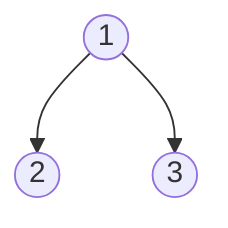
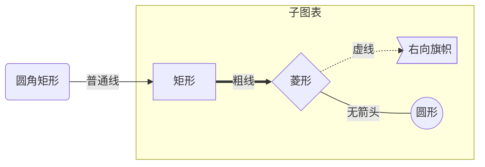
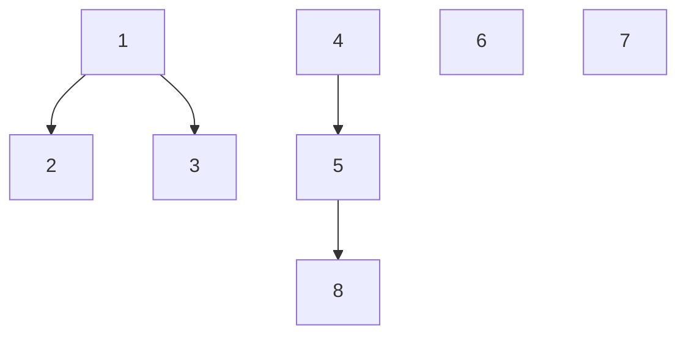

# 常用数学公式符号

```
+ 	- 	\times 	\div	 \pm 	\mp
```

​	$+ \quad  -  \quad \times  \quad \div \quad  \pm  \quad \mp$

```
 = 	\ne	 \approx \equiv   > 	< 	\ge    \le 
 \begin{equation}a\xlongequal[abc]{def}b\end{equation}
```

​	$ = \quad  \ne \quad  \approx \quad \equiv \quad >  \quad <  \quad \ge  \quad \le$ $\quad$ $\begin{equation}a\xlongequal[abc]{def}b\end{equation}$

```
\emptyset \in \notin \subseteq \nsubseteq \supseteq \nsupseteq
```

​    $\emptyset \quad \in \quad \notin \quad \subseteq  \quad \nsubseteq \quad \supseteq \quad \nsupseteq$ 

```
\cap \cup \bigcap \bigcup \oplus
```

​    $\cap \quad \cup \quad \bigcap \quad \bigcup \quad \oplus $ 

```
f^\prime     f^{\prime\prime}
f'           f''
```

​		$f^\prime  \quad f^{\prime\prime}$

```
\sqrt{2} 	\sqrt[n]{x} 	|a|	   \frac{1}{n}   \vec{a}   \bar{a}
```

​	$ \sqrt{2}  \quad \sqrt[n]{x} \quad |a|\quad \frac{1}{n} \quad \vec{a} \quad \bar{a}$ 

```
\triangle	 \perp 	\parallel 	\angle 	45^\circ$  \overset{\frown}{AB}
```

​	$\triangle \quad  \perp \quad  \parallel  \quad \angle 45^\circ  \quad \overset{\frown}{AB}$ 

```
\forall 	\exists 	\therefore 	 \because  \or  \land   \lnot \Rightarrow  \Leftarrow \Leftrightarrow
```

​	$\forall \quad  \exists  \quad \therefore  \quad \because \quad \lor \quad \land \quad \lnot \quad \Rightarrow \quad \Leftarrow \quad \Leftrightarrow$

```
\gets  \to \leftrightarrow \rightleftharpoons \xleftarrow{left} \xrightarrow{right}
```

​	$\gets  \quad \to  \quad \leftrightarrow \quad  \rightleftharpoons \quad \xleftarrow[1]{2}  \quad \xrightarrow[1]{2}$

```
\sum\limits_{i=1}^n a_i 	\prod\limits_{i=1}^n a_i
```

​	$\sum\limits_{i=1}^n a_i \quad  \prod\limits_{i=1}^n a_i$

```
\lim\limits_{n\to\infty} f(x)	\int_{a}^{b} e^x\,dx 	\iint 	\iiint   \infin \oint
```

​	$\lim\limits_{n\to\infty} f(x) \quad  \int_{a}^{b}e^x\,dx  \quad \iint  \quad \iiint \quad \infin \quad \oint$ 

```
\begin{vmatrix}a&b\\c&d\end{vmatrix}
\begin{bmatrix}a&b\\c&d\end{bmatrix}
\cdots   \ddots     \vdots
```

​	$\begin{vmatrix}a&b\\c&d\end{vmatrix}$                      $\begin{bmatrix}a&b\\c&d\end{bmatrix}$         $\cdots$             $\ddots$                $\vdots$

```
f(x)=\begin{cases}x-1&x\leqslant3\\x^2+3x-1&x>3\end{cases}
```

​	$f(x)=\begin{cases}x-1&x\leqslant3\\x^2+3x-1&x>3\end{cases}$

```
\alpha	\beta	\gamma	\delta	\eta	\theta
\lambda	 \mu      \nu	 \pi     \rho  	\sigma
\tau   \omega	\varepsilon	   \varphi   \partial  \Omega
```

​	$\alpha \quad  \beta  \quad \gamma \quad  \delta  \quad \eta  \quad \theta$
​	$\lambda \quad 	\mu \quad 	\nu \quad 	\pi	 \quad \rho	 \quad \sigma$
​	$\tau	 \quad \omega  \quad 	\varepsilon  \quad \varphi \quad \partial \quad \Omega$

```
\left\lfloor A \right\rfloor  \left\lceil B \right\rceil
```

​	$\left\lfloor A \right\rfloor   \quad \left\lceil B \right\rceil$








